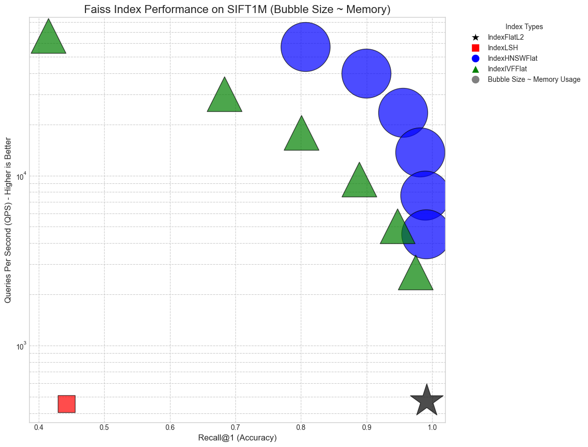

#  FAISS Indexes Comparison on SIFT1M

This project benchmarks and compares popular FAISS indexing strategies using the standard [SIFT1M](ftp://ftp.irisa.fr/local/texmex/corpus/sift.tar.gz) dataset for approximate nearest neighbor search.

📘 **All experiments, code, and results are inside the Jupyter Notebook**  
➡️ [Open in Colab](https://colab.research.google.com/github/saidineshpola/Indexes-comparision/blob/main/Notebook.ipynb)  

## Covered Index Types

- `IndexFlatL2` – Brute-force baseline
- `IndexLSH` – Locality Sensitive Hashing
- `IndexHNSWFlat` – Hierarchical Navigable Small World graph
- `IndexIVFFlat` – Inverted File Index

## 📊 Metrics Compared

- Build Time  
- Search Time  
- Recall@1  
- Queries Per Second (QPS)  
- Memory Usage  

##  Dataset

We use the standard **SIFT1M** dataset (1 million vectors, 128-D) which can be downloaded from:
[ftp://ftp.irisa.fr/local/texmex/corpus/sift.tar.gz](ftp://ftp.irisa.fr/local/texmex/corpus/sift.tar.gz)

## 🧪 Results Summary

Includes a performance table and conclusion section highlighting trade-offs across indexing methods.
Ideal for understanding real-world performance of vector search indexes.

---

## 📊 Benchmark Summary (SIFT1M)

| Method                  | Build Time | Search Time | QPS    | Recall\@1 | Memory Usage |
| ----------------------- | ---------- | ----------- | ------ | --------- | ------------ |
| **IndexFlatL2**         | 0.18 s     | 21.07 s     | 474    | 0.9914    | 488.28 MB    |
| **IndexLSH**            | 4.65 s     | 22.02 s     | 454    | 0.4421    | 122.57 MB    |
| **HNSW (ef=32)**        | 108.46 s   | 0.426 s     | 23,448 | 0.9553    | 991.88 MB    |
| **IVFFlat (nprobe=16)** | 18.40 s    | 1.05 s      | 9,532  | 0.8885    | 497.94 MB    |

🔗 [Read the Notebook](https://github.com/saidineshpola/Indexes-comparision/blob/main/Notebook.ipynb)  
📬 For questions or collaboration: [saidines12@gmail.com](mailto:saidines12@gmail.com)

